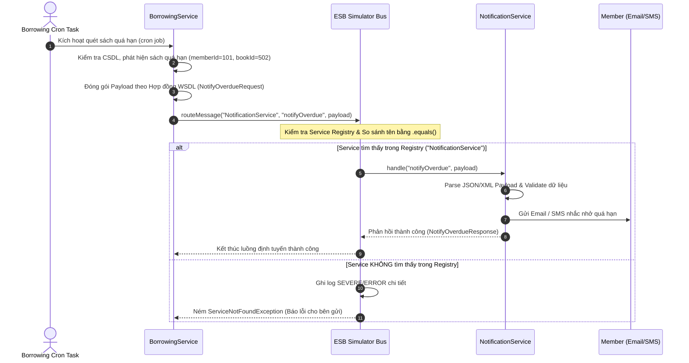

# LibraX System - SS2 Bài Tập 2: Tách Dịch Vụ Theo Phong Cách SOA Với Hợp Đồng Dịch Vụ

Tài liệu báo cáo phân tích, sửa lỗi **ESB Simulator**, thiết kế **Hợp đồng dịch vụ SOA (WSDL 1.1)** và mô tả **Luồng đi thông điệp** cho hệ thống mượn sách **LibraX**.

---

## 1. Phân Tích Lỗi Của ESB Simulator & Giải Pháp Khắc Phục

### 1.1 Phân tích lỗi so sánh chuỗi bằng toán tử `==` trong Java

#### Đoạn code ban đầu (Có lỗi):
```java
if (toService == "NotificationService") {
    notificationService.handle(operation, payload);
} else if (toService == "PaymentService") {
    paymentService.handle(operation, payload);
}
```

#### Phân tích nguyên nhân kỹ thuật:
1. **Bản chất toán tử `==` trong Java**:
   - Toán tử `==` dùng để so sánh **địa chỉ ô nhớ (memory reference)** của 2 đối tượng trong vùng nhớ Heap, chứ **không so sánh giá trị nội dung ký tự** của chuỗi.
2. **String Pool vs. Heap Memory**:
   - Khi viết hằng số chuỗi `"NotificationService"`, Java lưu trữ chuỗi này trong vùng nhớ đặc biệt gọi là **String Constant Pool**.
   - Khi biến `toService` được nhận từ bên ngoài (ví dụ: parse từ request HTTP, JSON payload, CSDL hoặc giao thức mạng ở thời điểm runtime), Java sẽ khởi tạo một đối tượng `String` mới nằm trong vùng nhớ **Heap**.
   - Mặc dù hai chuỗi có nội dung ký tự giống hệt nhau (`"NotificationService"`), địa chỉ ô nhớ của chúng hoàn toàn khác nhau (`toService != "NotificationService"`).
3. **Hậu quả**:
   - Điều kiện `if (toService == "NotificationService")` sẽ đánh giá thành `false`, khiến ESBSimulator không định tuyến được thông điệp mặc dù tên service truyền vào hoàn toàn đúng!

#### Giải pháp khắc phục:
Sử dụng phương thức `.equals()` hoặc `Objects.equals()` để so sánh nội dung chuỗi (character-by-character comparison):
```java
if ("NotificationService".equals(toService)) {
    notificationService.handle(operation, payload);
}
```
Hoặc trong thiết kế động dùng `Objects.equals(entry.getKey(), toService)` / tra cứu qua `Map.get(toService)`.

---

### 1.2 Phân tích vấn đề thiếu nhánh `else` trong ESB routing

#### Đoạn code ban đầu (Có lỗi):
- Thiếu hoàn toàn nhánh `else` khi `toService` không khớp với bất kỳ dịch vụ nào đã đăng ký (`NotificationService`, `PaymentService`).

#### Phân tích nguy cơ:
1. **Lỗi âm thầm (Silent Failure)**:
   - Khi một dịch vụ gửi thông điệp tới tên dịch vụ bị sai (ví dụ: gõ nhầm `"NotifService"` hoặc tên dịch vụ chưa đăng ký), thông điệp sẽ rơi vào "khoảng trống" và bị hủy bỏ mà không có bất kỳ log hay cảnh báo nào.
2. **Khó khăn trong Debug & Vận hành**:
   - Bên phát thông điệp (`BorrowingService`) mặc định cho rằng thông điệp đã được gửi thành công, trong khi bên nhận (`NotificationService`) hoàn toàn không nhận được gì. Không có Exception ném ra hay Warning Log nào xuất hiện trong hệ thống giám sát.

#### Giải pháp khắc phục:
Bổ sung nhánh `else` xử lý triệt để:
- **Logging**: Ghi log cảnh báo ở cấp độ `SEVERE`/`ERROR` chứa đầy đủ thông tin: `toService`, `operation`, `payload`.
- **Exception Handling / DLQ**: Ném ra ngoại lệ `ServiceNotFoundException` để báo cho bên gửi, hoặc chuyển thông điệp vào hàng chờ thư chết (**Dead Letter Queue**) để phục hồi/phân tích sau.

```java
if (targetService != null) {
    targetService.handle(operation, payload);
} else {
    String errorMessage = String.format("[ESB ROUTING FAILURE] Target service '%s' is not registered in ESB. Operation: '%s', Payload: %s", toService, operation, payload);
    logger.severe(errorMessage);
    throw new ServiceNotFoundException(errorMessage);
}
```

---

## 2. Code ESB Simulator Và Các Dịch Vụ Đã Sửa Lỗi hoàn chỉnh

Mã nguồn Java hoàn chỉnh nằm tại thư mục `d:\microservice\BaiTap\SS2\BaiTap2\src\main\java\com\librax`:

### Lớp `EsbSimulator.java`
```java
package com.librax.esb;

import com.librax.service.ServiceInterface;
import java.util.Map;
import java.util.Objects;
import java.util.concurrent.ConcurrentHashMap;
import java.util.logging.Logger;

public class EsbSimulator {
    private static final Logger logger = Logger.getLogger(EsbSimulator.class.getName());
    private final Map<String, ServiceInterface> serviceRegistry = new ConcurrentHashMap<>();

    public void registerService(ServiceInterface service) {
        if (service != null && service.getServiceName() != null) {
            serviceRegistry.put(service.getServiceName(), service);
            logger.info("[ESB BUS] Service registered: " + service.getServiceName());
        }
    }

    public void routeMessage(String toService, String operation, String payload) {
        logger.info(String.format("[ESB BUS] Routing message to '%s', Operation: '%s'", toService, operation));

        ServiceInterface targetService = null;
        if (toService != null) {
            for (Map.Entry<String, ServiceInterface> entry : serviceRegistry.entrySet()) {
                // SỬA LỖI 1: Dùng Objects.equals() thay vì toán tử '=='
                if (Objects.equals(entry.getKey(), toService)) {
                    targetService = entry.getValue();
                    break;
                }
            }
        }

        // SỬA LỖI 2: Bổ sung nhánh else xử lý khi không khớp dịch vụ nào
        if (targetService != null) {
            targetService.handle(operation, payload);
        } else {
            String errorMsg = String.format("[ESB ROUTING FAILURE] Service '%s' is not registered! Operation: '%s'", toService, operation);
            logger.severe(errorMsg);
            throw new ServiceNotFoundException(errorMsg);
        }
    }
}
```

---

## 3. Hợp Đồng Dịch Vụ SOA (Service Contract - WSDL 1.1 Rút Gọn)

Tài liệu hợp đồng dịch vụ chuẩn XML WSDL cho thao tác `notifyOverdue(memberId, bookId, dueDate)`:

```xml
<?xml version="1.0" encoding="UTF-8"?>
<wsdl:definitions name="NotificationServiceContract"
    targetNamespace="http://librax.com/services/notification"
    xmlns:tns="http://librax.com/services/notification"
    xmlns:wsdl="http://schemas.xmlsoap.org/wsdl/"
    xmlns:xsd="http://www.w3.org/2001/XMLSchema"
    xmlns:soap="http://schemas.xmlsoap.org/wsdl/soap/">

    <!-- 1. DEFINITION OF DATA TYPES (XML Schema) -->
    <wsdl:types>
        <xsd:schema targetNamespace="http://librax.com/services/notification">
            
            <!-- Request Data Structure -->
            <xsd:element name="notifyOverdueRequest">
                <xsd:complexType>
                    <xsd:sequence>
                        <xsd:element name="memberId" type="xsd:long" minOccurs="1"/>
                        <xsd:element name="bookId" type="xsd:long" minOccurs="1"/>
                        <xsd:element name="dueDate" type="xsd:date" minOccurs="1"/>
                    </xsd:sequence>
                </xsd:complexType>
            </xsd:element>

            <!-- Response Data Structure -->
            <xsd:element name="notifyOverdueResponse">
                <xsd:complexType>
                    <xsd:sequence>
                        <xsd:element name="success" type="xsd:boolean"/>
                        <xsd:element name="message" type="xsd:string"/>
                        <xsd:element name="timestamp" type="xsd:dateTime"/>
                    </xsd:sequence>
                </xsd:complexType>
            </xsd:element>

            <!-- Fault Data Structure -->
            <xsd:element name="serviceFault">
                <xsd:complexType>
                    <xsd:sequence>
                        <xsd:element name="errorCode" type="xsd:string"/>
                        <xsd:element name="errorMessage" type="xsd:string"/>
                    </xsd:sequence>
                </xsd:complexType>
            </xsd:element>
        </xsd:schema>
    </wsdl:types>

    <!-- 2. MESSAGES DEFINITION -->
    <wsdl:message name="NotifyOverdueInputMessage">
        <wsdl:part name="parameters" element="tns:notifyOverdueRequest"/>
    </wsdl:message>

    <wsdl:message name="NotifyOverdueOutputMessage">
        <wsdl:part name="parameters" element="tns:notifyOverdueResponse"/>
    </wsdl:message>

    <wsdl:message name="ServiceFaultMessage">
        <wsdl:part name="fault" element="tns:serviceFault"/>
    </wsdl:message>

    <!-- 3. PORT TYPE (INTERFACE DEFINITION) -->
    <wsdl:portType name="NotificationPortType">
        <wsdl:operation name="notifyOverdue">
            <wsdl:documentation>Thao tác gửi thông báo nhắc nhở độc giả khi sách mượn quá hạn</wsdl:documentation>
            <wsdl:input message="tns:NotifyOverdueInputMessage"/>
            <wsdl:output message="tns:NotifyOverdueOutputMessage"/>
            <wsdl:fault name="ServiceFault" message="tns:ServiceFaultMessage"/>
        </wsdl:operation>
    </wsdl:portType>

    <!-- 4. BINDING DEFINITION -->
    <wsdl:binding name="NotificationSoapBinding" type="tns:NotificationPortType">
        <soap:binding style="document" transport="http://schemas.xmlsoap.org/soap/http"/>
        <wsdl:operation name="notifyOverdue">
            <soap:operation soapAction="http://librax.com/services/notification/notifyOverdue"/>
            <wsdl:input>
                <soap:body use="literal"/>
            </wsdl:input>
            <wsdl:output>
                <soap:body use="literal"/>
            </wsdl:output>
            <wsdl:fault name="ServiceFault">
                <soap:fault name="ServiceFault" use="literal"/>
            </wsdl:fault>
        </wsdl:operation>
    </wsdl:binding>

    <!-- 5. SERVICE ENDPOINT DEFINITION -->
    <wsdl:service name="NotificationService">
        <wsdl:port name="NotificationPort" binding="tns:NotificationSoapBinding">
            <soap:address location="http://localhost:8080/esb/services/NotificationService"/>
        </wsdl:port>
    </wsdl:service>

</wsdl:definitions>
```

---

## 4. Phân Tích Luồng Đi Của Thông Điệp (Message Flow)

### 4.1 Sơ đồ Sequence Diagram (Mermaid)



### 4.2 Chi tiết 5 bước của luồng thông điệp:

1. **Bước 1 — Phát hiện sự kiện quá hạn**:
   - `BorrowingService` phát hiện một giao dịch mượn sách có ngày trả (`dueDate`) nhỏ hơn ngày hiện tại.
2. **Bước 2 — Đóng gói thông điệp theo Hợp đồng dịch vụ**:
   - `BorrowingService` tạo đối tượng payload chuẩn `NotifyOverdueRequest` gồm 3 trường thông tin: `memberId`, `bookId`, `dueDate`.
3. **Bước 3 — Phát thông điệp qua tầng trung gian ESB**:
   - `BorrowingService` không gọi trực tiếp `NotificationService`, mà phát thông điệp đến `EsbSimulator.routeMessage("NotificationService", "notifyOverdue", payload)`.
4. **Bước 4 — Định tuyến thông điệp tại ESB Simulator**:
   - ESB Simulator nhận thông điệp, tra cứu tên dịch vụ mục tiêu trong Service Registry bằng phương thức `.equals()`.
   - Nếu tìm thấy, ESB chuyển tiếp thông điệp đến `NotificationService`.
   - Nếu không tìm thấy, ESB ghi log lỗi `SEVERE` và ném `ServiceNotFoundException`.
5. **Bước 5 — Tiếp nhận & Xử lý tại NotificationService**:
   - `NotificationService` tiếp nhận thông điệp, bóc tách thông tin `memberId`, `bookId`, `dueDate` và tiến hành gửi email/SMS thông báo cho độc giả.

---

## 5. Kiểm Thử Và Chạy Demo

Trong thư mục `d:\microservice\BaiTap\SS2\BaiTap2`:
```powershell
# Biên dịch và chạy file Main demo
javac -d bin (Get-ChildItem -Recurse -Filter *.java).FullName
java -cp bin com.librax.Main
```
 Kết quả đầu ra kiểm thử khẳng định định tuyến thành công tới `NotificationService` và bắt lỗi đúng khi định tuyến tới service không tồn tại.
