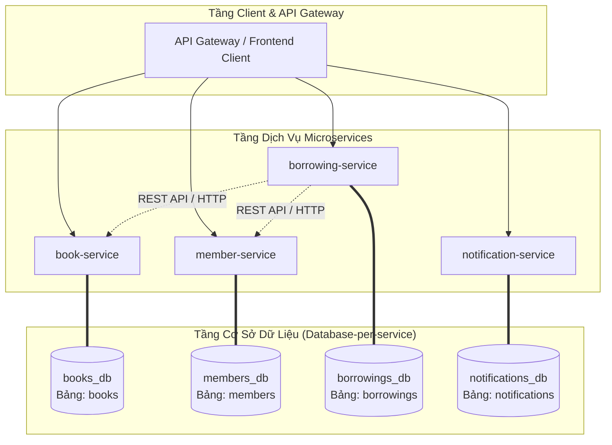

# LibraX System - SS2 Bài Tập 4: Phân Tích Và Tái Thiết Kế Tầng Dữ Liệu Theo Database-per-service

Tài liệu báo cáo phân tích rủi ro Data Coupling, sơ đồ kiến trúc **Database-per-service**, mã nguồn tái thiết kế phương thức `getBorrowingDetail` (API Aggregation Pattern) và bài phân tích giải pháp cho các thách thức phát sinh sau khi tách CSDL (Saga Pattern & CQRS/Caching) cho hệ thống **LibraX**.

---

## 1. Phân Tích Chi Tiết Các Rủi Ro Data Coupling Đang Tồn Tại

### 1.1 Đoạn code ban đầu (Có rủi ro nghiêm trọng):

```java
@Service
public class BorrowingService {

    @Autowired
    private JdbcTemplate jdbcTemplate;

    public String getBorrowingDetail(Long borrowingId) {
        // borrowing-service JOIN trực tiếp sang bảng "books" và "members",
        // vốn thuộc quyền sở hữu của book-service và member-service
        String sql = "SELECT b.title, m.name FROM borrowings br " +
                     "JOIN books b ON br.book_id = b.id " +
                     "JOIN members m ON br.member_id = m.id " +
                     "WHERE br.id = ?";
        return jdbcTemplate.queryForObject(sql, String.class, borrowingId);
    }
}
```

### 1.2 Liệt kê cụ thể các điểm vi phạm nguyên tắc Database-per-service:

| Service Vi Phạm | Bảng Bị Xâm Phạm | Service Sở Hữu Chuẩn | Loại Vi Phạm |
| :--- | :--- | :--- | :--- |
| `borrowing-service` | `books` | `book-service` | Cross-Domain SQL JOIN |
| `borrowing-service` | `members` | `member-service` | Cross-Domain SQL JOIN |

### 1.3 Phân tích 4 rủi ro kỹ thuật nguy hiểm:

1. **Phá vỡ Ranh giới Đóng gói Dữ liệu (Data Encapsulation & Domain Boundary)**:
   - Trong kiến trúc Microservices, dữ liệu của một service là riêng tư (private data). Việc `borrowing-service` truy cập trực tiếp vào bảng `books` và `members` đã biến cơ sở dữ liệu chung `librax_db` thành một điểm kết nối cứng (Tight Coupling) ở tầng dữ liệu.
2. **Phụ thuộc chặt vào Schema CSDL (Database Schema Dependency)**:
   - Nhóm phát triển `book-service` hoặc `member-service` mất hoàn toàn quyền tự do thay đổi cấu trúc CSDL. Nếu họ đổi tên cột `title` thành `book_title` hoặc chuẩn hóa bảng `members`, phương thức `getBorrowingDetail` của `borrowing-service` sẽ lập tức bị ném ngoại lệ SQL Error và crash ứng dụng.
3. **Nguy cơ Khóa Bảng & Nghẽn Tài Nguyên (Table Locks & Resource Contention)**:
   - Các câu lệnh SQL JOIN phức tạp hoặc các truy vấn quét diện rộng (Table Scan) xuất phát từ `borrowing-service` có thể gây khóa bảng (Table Lock/Row Lock) trên bảng `books` hoặc `members`. Điều này làm đình trệ toàn bộ các tác vụ đọc/ghi của `book-service` và `member-service`.
4. **Triệt tiêu khả năng Độc lập Lựa chọn Công nghệ CSDL (Loss of Database Autonomy)**:
   - Do chung một CSDL `librax_db`, tất cả các service buộc phải dùng chung một công nghệ CSDL (ví dụ: MySQL). `book-service` không thể chuyển sang ElasticSearch để tối ưu tìm kiếm sách, và `notification-service` không thể dùng MongoDB/Redis để tối ưu tốc độ ghi log.

---

## 2. Sơ Đồ Kiến Trúc Tách Database-per-service

Chuyển đổi từ CSDL monolithic duy nhất `librax_db` thành **4 cơ sở dữ liệu độc lập**, mỗi CSDL thuộc sở hữu độc quyền của một Microservice tương ứng:



### Bảng Phân Định Sở Hữu CSDL Dữ Liệu:

- `books_db` (Sở hữu độc quyền bởi `book-service`): Quản lý bảng `books`.
- `members_db` (Sở hữu độc quyền bởi `member-service`): Quản lý bảng `members`.
- `borrowings_db` (Sở hữu độc quyền bởi `borrowing-service`): Quản lý bảng `borrowings` (Lưu `book_id` và `member_id` dạng khóa ngoại logic/ID đơn thuần).
- `notifications_db` (Sở hữu độc quyền bởi `notification-service`): Quản lý bảng `notifications`.

---

## 3. Mã Nguồn Tái Thiết Kế `getBorrowingDetail` (Không Dùng SQL JOIN)

Áp dụng mẫu thiết kế **API Aggregation Pattern**: `borrowing-service` chỉ truy vấn CSDL `borrowings_db` của chính nó, sau đó thực hiện các cuộc gọi REST API song song (`CompletableFuture`) sang `book-service` và `member-service` để lấy dữ liệu chi tiết.

### Mã nguồn `BorrowingService.java` hoàn chỉnh:

```java
package com.librax.borrowing.service;

import com.librax.borrowing.client.BookClient;
import com.librax.borrowing.client.MemberClient;
import com.librax.borrowing.dto.BookResponse;
import com.librax.borrowing.dto.BorrowingDetailResponse;
import com.librax.borrowing.dto.MemberResponse;
import com.librax.borrowing.model.Borrowing;
import com.librax.borrowing.repository.BorrowingRepository;
import lombok.RequiredArgsConstructor;
import lombok.extern.slf4j.Slf4j;
import org.springframework.stereotype.Service;

import java.util.concurrent.CompletableFuture;

@Service
@RequiredArgsConstructor
@Slf4j
public class BorrowingService {

    private final BorrowingRepository borrowingRepository;
    private final BookClient bookClient;
    private final MemberClient memberClient;

    /**
     * getBorrowingDetail ĐÃ ĐƯỢC TÁI THIẾT KẾ:
     * - KHÔNG dùng SQL JOIN xuyên bảng sang 'books' hay 'members'.
     * - Chỉ truy vấn duy nhất CSDL borrowings_db.
     * - Tổng hợp dữ liệu bằng gọi song song REST API sang book-service và member-service.
     */
    public BorrowingDetailResponse getBorrowingDetail(Long borrowingId) {
        log.info("Fetching borrowing record from borrowings_db for ID: {}", borrowingId);

        // 1. Chỉ truy vấn CSDL riêng của borrowing-service (bảng borrowings)
        Borrowing borrowing = borrowingRepository.findById(borrowingId)
                .orElseThrow(() -> new RuntimeException("Không tìm thấy phiếu mượn với ID: " + borrowingId));

        Long bookId = borrowing.getBookId();
        Long memberId = borrowing.getMemberId();

        // 2. Thực hiện gọi API REST song song (Async API Aggregation)
        CompletableFuture<BookResponse> bookFuture = CompletableFuture.supplyAsync(
                () -> bookClient.getBookById(bookId)
        );

        CompletableFuture<MemberResponse> memberFuture = CompletableFuture.supplyAsync(
                () -> memberClient.getMemberById(memberId)
        );

        // Chờ cả 2 API trả về kết quả
        CompletableFuture.allOf(bookFuture, memberFuture).join();

        BookResponse bookResponse = bookFuture.join();
        MemberResponse memberResponse = memberFuture.join();

        // 3. Đóng gói dữ liệu tổng hợp trả về cho client
        return BorrowingDetailResponse.builder()
                .borrowingId(borrowing.getId())
                .bookId(bookId)
                .bookTitle(bookResponse != null ? bookResponse.getTitle() : "Unknown Title")
                .bookAuthor(bookResponse != null ? bookResponse.getAuthor() : "Unknown Author")
                .memberId(memberId)
                .memberName(memberResponse != null ? memberResponse.getFullName() : "Unknown Member")
                .memberEmail(memberResponse != null ? memberResponse.getEmail() : "Unknown Email")
                .borrowDate(borrowing.getBorrowDate())
                .returnDate(borrowing.getReturnDate())
                .status(borrowing.getStatus())
                .build();
    }
}
```

---

## 4. Phân Tích Các Bài Toán Mới Phát Sinh Và Hướng Xử Lý

Sau khi tách CSDL thành **Database-per-service**, hệ thống không còn dùng chung CSDL nên sẽ phát sinh **2 bài toán lớn kinh điển**:

### 4.1 Bài toán 1: Thất thoát tính toàn vẹn giao dịch (Loss of ACID / Distributed Transactions)

#### Phân tích bài toán:
- Trước đây (Monolith/Shared DB), khi thực hiện mượn sách, toàn bộ các bước:
  1. Giảm `availableCopies` trong bảng `books`.
  2. Tăng `currentBorrowedCount` trong bảng `members`.
  3. Tạo phiếu mượn mới trong bảng `borrowings`.
  Đều nằm trong **MỘT Transaction duy nhất của CSDL (ACID)**. Nếu bước 3 lỗi, CSDL tự động `ROLLBACK` bước 1 và 2.
- Sau khi tách CSDL thành `books_db`, `members_db`, `borrowings_db`, việc gọi REST API cập nhật 3 CSDL độc lập không thể dùng `@Transactional` cơ bản nữa. Nếu bước 1 và 2 đã cập nhật thành công nhưng bước 3 bị lỗi kết nối mạng, dữ liệu sẽ bị **bất đồng bộ nghiêm trọng** (sách bị trừ kho nhưng phiếu mượn không được tạo).

#### Giải pháp đề xuất:
Sử dụng mẫu thiết kế **Saga Pattern (Saga Choreography hoặc Saga Orchestration)**:
- **Nguyên lý**: Thay vì dùng giao dịch 2-Phase Commit (2PC) gây block tài nguyên, Saga chia giao dịch lớn thành chuỗi các giao dịch cục bộ (Local Transactions).
- **Hành động Bù trừ (Compensating Transactions)**: Nếu một bước trong chuỗi Saga thất bại (ví dụ: tạo phiếu mượn thất bại), Saga Orchestrator sẽ kích hoạt các giao dịch bù trừ ngược lại (Compensation Transactions): phát sự kiện hoàn trả lại số lượng sách trong `books_db` và giảm lại đếm trong `members_db`, đưa hệ thống về trạng thái đồng nhất (Eventual Consistency).

---

### 4.2 Bài toán 2: Suy giảm hiệu năng do truy vấn xuyên dịch vụ (Cross-Service Query Latency)

#### Phân tích bài toán:
- Việc gọi SQL JOIN trong cùng 1 CSDL cục bộ diễn ra ở cấp độ **Milisecond (Vài miligiây)** thông qua RAM/Disk của CSDL.
- Khi chuyển sang gọi REST API qua mạng HTTP (như phương thức `getBorrowingDetail` ở trên), mỗi cuộc gọi REST tốn chi phí mở kết nối TCP, serialization/deserialization JSON và độ trễ mạng (Network Latency).
- Nếu cần hiển thị danh sách 50 phiếu mượn, ứng dụng có thể vướng lỗi **N+1 HTTP Calls** (thực hiện 100 cuộc gọi REST sang `book-service` và `member-service`), gây nghẽn mạng và tải chậm.

#### Giải pháp đề xuất:
1. **Áp dụng CQRS Pattern (Command Query Responsibility Segregation)**:
   - Tách riêng đường xử lý Ghi (Command) và Đường xử lý Đọc/Báo cáo (Query).
   - Xây dựng một **Read-Model Database / Read Replica** chuyên phục vụ hiển thị màn hình phiếu mượn.
2. **Event-Driven Data Replication (CDC - Change Data Capture / Kafka)**:
   - Mỗi khi `book-service` cập nhật tên sách hoặc `member-service` cập nhật tên độc giả, họ sẽ phát sự kiện (`BookUpdatedEvent`, `MemberUpdatedEvent`) lên Message Broker (Kafka/RabbitMQ).
   - `borrowing-service` đăng ký lắng nghe sự kiện này và lưu bản sao đệm (Read Cache/Denormalized View) của `title` và `name` vào CSDL `borrowings_db` hoặc Redis Cache. Khi cần xem chi tiết, `borrowing-service` chỉ cần đọc tại chỗ trong CSDL của mình mà không cần gọi REST API đi đâu nữa.
